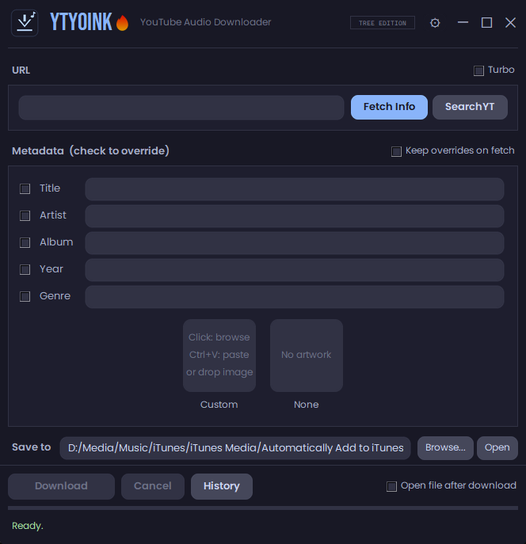
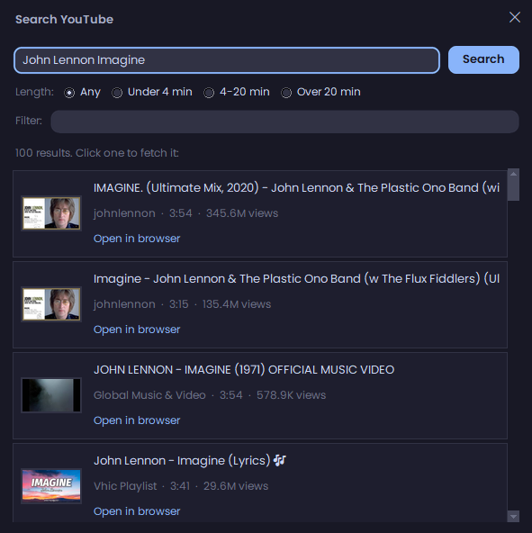
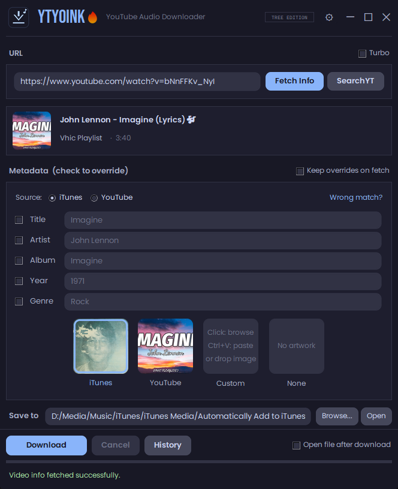
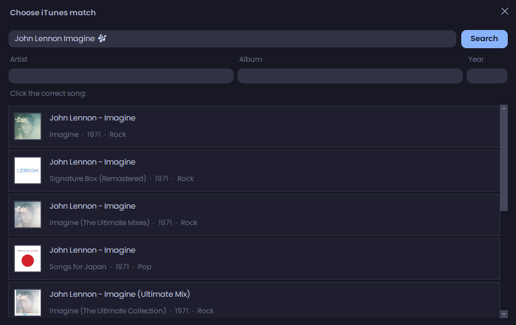

# YTYoink

**Every line of this app was written by AI**, with a human directing, testing, and approving each release. That goes for all SloppyVibes projects: 100% AI coded, human steered.

YTYoink is a Windows app that turns YouTube videos into clean, properly tagged audio files, ready for iTunes, your phone, or any music library. Paste a link or search right inside the app, and it handles the rest: downloading, converting, matching real metadata from the iTunes catalog, and embedding cover art.

## Features

- **Paste a URL and hit Fetch Info.** The app pulls the video, finds the matching song on iTunes, and fills in title, artist, album, year, and genre automatically.
- **SearchYT.** No link? Search YouTube from inside the app: 100 results with thumbnails, view counts, a length filter (under 4 min, 4 to 20, over 20), and a live filter box to narrow by title or channel. Click a result to fetch it, or open it in your browser first.
- **Real metadata, your call.** iTunes match wrong? Hit "Wrong match?" and pick from candidates, edit the search, filter by artist, album, or year, pull a full album tracklist, or paste an Apple Music link for songs the store search cannot find.
- **Cover art done right.** Choose between the iTunes artwork, the YouTube thumbnail, your own image (browse, paste with Ctrl+V, or drag and drop), or none. Hover any artwork for a zoomed preview.
- **Playlists, tamed.** Optional playlist picker with checkboxes, quick search, shift-click range select, and a review-each-one mode so you approve the metadata for every song in a batch. Auto-generated YouTube Mixes are ignored by default so pasting a link out of a Mix just downloads that one video.
- **Download history and duplicate warnings.** A history popup remembers everything, and an amber badge warns you when you are about to download something you already grabbed, with the date and filename on hover.
- **Formats.** M4A by default (plays nice with iTunes and iPhone), plus MP3 and Opus. Opus keeps embedded cover art too.
- **Turbo mode** skips the metadata stage entirely when you just want the audio fast.

&nbsp;&nbsp;

## Installation

1. Download **YTYoink_setup.exe** from the [latest release](../../releases/latest). Ignore the other files on the release page (`YTYoink.exe`, `YTYoink_full.zip`): those are downloaded automatically by the installer and the auto-updater, never by you.
2. Run it. Windows SmartScreen may warn you because the app is not code-signed (certificates cost money and this is a small personal project). Click **More info**, then **Run anyway**.
3. Approve the administrator prompt. The app installs to Program Files.
4. The setup then does everything on its own, and tells you what it is doing at each step:
   - downloads the full app package (about 36 MB) from this page
   - installs it and creates Start Menu and Desktop shortcuts
   - launches the app
5. On first launch the app checks its dependencies and **installs anything missing automatically**: yt-dlp and FFmpeg, via winget when available or direct official downloads otherwise (FFmpeg is about 80 MB, so the very first launch can take a couple of minutes). Progress shows in the status bar at the bottom. When it says **Ready.** you are good to go.

Nothing else to configure. Pick a save folder once (pointing it at iTunes' "Automatically Add to iTunes" folder is a popular choice) and start yoinking.

## How to use

The everyday flow is three clicks:

1. **Paste a YouTube link** in the URL box (or hit **SearchYT** and find the song by name, then click a result).
2. **Hit Fetch Info.** The app pulls the video, matches the song on iTunes, and fills in title, artist, album, year, genre, and artwork. Look it over:
   - Wrong song or album? Click **Wrong match?** and pick the right one, or refine the search with artist, album, and year filters:

   

   - Want different cover art? Click one of the artwork tiles: **iTunes**, **YouTube**, **Custom** (browse, Ctrl+V paste, or drag an image in), or **None**. Hover a tile to see it enlarged.
   - Want to change a field by hand? Tick the checkbox next to it and type your own value.
3. **Hit Download.** The tagged audio file lands in your Save to folder. Done.

Worth knowing:

- An orange **!** next to the video title means you already downloaded this one before. Hover it to see when.
- **Turbo** (top right) skips all the metadata work and just grabs the audio as fast as possible.
- **History** shows everything you have downloaded, newest first.
- The **gear icon** opens settings: output format (M4A, MP3, Opus), preferred metadata and artwork source, and playlist behavior.
- Pasting a playlist link (with playlist asking enabled in settings) pops a checklist so you pick exactly which videos to grab, with a search box and a review-each-one mode for per-song metadata control.

## Updates

YTYoink keeps itself current. Every launch it checks this page for a new version, shows a small progress window if one is found, and relaunches itself updated. It also keeps yt-dlp fresh automatically, which matters because YouTube changes constantly and stale downloaders break.

## Built on the shoulders of giants

YTYoink is glue around some excellent open source software and public services. Credit where credit is due:

| Project | Role | License |
|---|---|---|
| [yt-dlp](https://github.com/yt-dlp/yt-dlp) | video/audio downloading | Unlicense |
| [FFmpeg](https://ffmpeg.org/) (builds by [gyan.dev](https://www.gyan.dev/ffmpeg/builds/)) | audio conversion and tagging | GPL |
| [mutagen](https://github.com/quodlibet/mutagen) | Opus cover art embedding | GPL-2.0 |
| [Pillow](https://python-pillow.org/) | artwork processing and the rounded UI | MIT-CMU |
| [Requests](https://requests.readthedocs.io/) + [certifi](https://github.com/certifi/python-certifi) | HTTPS everywhere | Apache-2.0 / MPL-2.0 |
| [PyInstaller](https://pyinstaller.org/) | packaging | GPL with exception |
| [iTunes Search API](https://developer.apple.com/library/archive/documentation/AudioVideo/Conceptual/iTuneSearchAPI/) | song metadata and artwork | Apple public API |
| [Poppins](https://fonts.google.com/specimen/Poppins) and [Bebas Neue](https://fonts.google.com/specimen/Bebas+Neue) | bundled fonts | SIL OFL 1.1 |

## Safety and verification

We take the "random exe from the internet" problem seriously. What you can check:

- **SHA-256 checksums** are published in every release's notes. After downloading, run `certutil -hashfile YTYoink_setup.exe SHA256` in a terminal and compare: a match proves your file is byte-for-byte the one we built and uploaded.
- **Every release is scanned on VirusTotal.** Each build is uploaded to [VirusTotal](https://www.virustotal.com) at release time and checked against ~70 antivirus engines; the scan report links are in every release's notes. You are welcome to re-upload and verify yourself.
- **About the few detections you may see there:** a handful of machine-learning heuristic engines (and occasionally Defender's cloud model, as generic "Wacatac!ml") flag unsigned Python-packaged apps on pattern alone. It is a well-documented false-positive class: the overwhelming majority of engines, including Kaspersky, BitDefender, ESET, Avast, Sophos, and Malwarebytes, rate every release clean. We file false-positive reports with vendors that misflag.
- **One source of truth.** The only official download location is this repository's Releases page, and the app only ever updates itself from here over HTTPS. If you got YTYoink anywhere else, do not run it.
- **Why SmartScreen still warns:** the app is not code-signed (publisher certificates are an ongoing cost that does not make sense for a small free tool yet). SmartScreen flags unsigned software by default regardless of its behavior. The checksums and scans above are the compensating transparency.

## Notes

- This repository hosts releases only. There is no source code here.
- Something acting up? See [TROUBLESHOOTING.md](TROUBLESHOOTING.md).
- YTYoink is a personal-use tool. Respect YouTube's Terms of Service and only download content you have the rights to.
